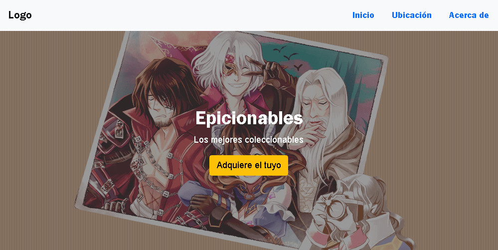

# Coleccionables

This project involves the development of a static page for a fictitious company called indie-collection.

## Table of contents

- [Overview](#overview)
  - [The challenge](#the-challenge)
  - [Screenshot](#screenshot)
  - [Links](#links)
- [My process](#my-process)
  - [Built with](#built-with)
  - [What I learned](#what-i-learned)
  - [Useful resources](#useful-resources)
- [Author](#author)

## Overview

### The challenge

Users should be able to:

- View the optimal layout for the site depending on their device's screen size

### Screenshot

### Links

- Solution URL: [Add solution URL here](https://your-solution-url.com)
- Live Site URL: [Add live site URL here](https://your-live-site-url.com)

## My process

### Built with

- Semantic HTML5 markup
- CSS custom properties
- Flexbox
- CSS Grid
- Mobile-first workflow
- Bootstrap
- JavaScript
- Emailjs

### What I learned

- i learned bootstrap 5 elemental
- I learned email validation with js
- I learned how to record and address emails sent with the "Emailjs" service.

### Useful resources

- [Bootstrap Doc](https://getbootstrap.com/docs/5.1/getting-started/introduction/) - The bootstrap documentation is essential for working with bootstrap.

- [Emailjs](https://www.emailjs.com/) - The Emailjs page provides all the necessary documentation for its use.

## Author

- Website - [Samuel Rodriguez](https://github.com/samuelpklm)
- Frontend Mentor - [@samuelpklm](https://www.frontendmentor.io/profile/samuelpklm)
- Email: samuelr76@gmail.com

